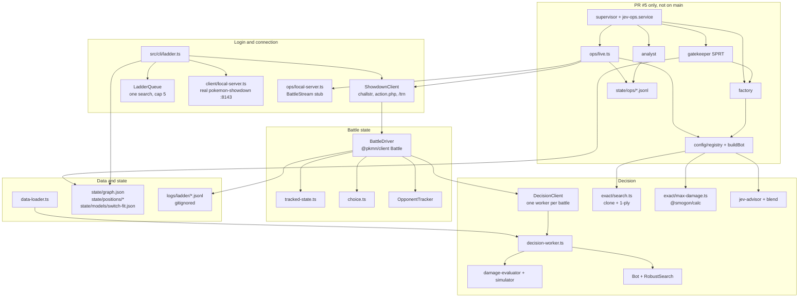

# System audit

Investigation only. No engine, client, or ops code was changed.

**Read on:** 2026-10-05.

**Trunk:** `main` at `87b268f` (merge of PR #1, `cursor/pokemon-showdown-bot-c043`). Line numbers with no other label are from that commit.

**Open ops PR:** [PR #5](https://github.com/Archdiner/jev-showdown/pull/5) (`cursor/ops-layer-882d` at `67d1ff4`) targets `main` and was still conflicting when this was read. It is not on `main`. Citations for `src/ops/**`, `src/config/**`, `configs/**`, and `deploy/**` are from `67d1ff4`. Where that branch rewrites a file that also exists on `main` (`src/graph/gate.ts`, `src/engine/exact/search.ts`, `src/llm/blend.ts`, `AGENTS.md`), both line numbers are given.

`npm install` has not been run here, so the Jest suite was not executed. The SPRT, Wilson, and Elo figures were recomputed in Node from the formulas in the source. Anything that depends on a live Showdown server is marked as a hypothesis.

There is no `run-live.sh` and no `cursor/config-layer` branch. The config layer is the first three commits on PR #5 (`2281a3e`, `0b73451`, `fd64ecf`). On `main`, live play is `npm run ladder`. On PR #5 it is also `npm run ops -- live`.

---

## 1. System map

`main` has one live decision path. PR #5 adds a second path that does not call the first.

On `main`, `npm run ladder` logs in, parses the battle protocol into `@pkmn/client` state, and asks a worker thread for a move. `--engine max-damage` (the default) scores moves with a hand-rolled damage formula. `--engine search` constructs `Bot`, which runs `RobustSearch` (a 3-ply rebuild of a `GameState`). The promoted exact 1-ply search, including the switch model from `fef4b81`, is what the offline gate and the benchmark harness call. It is not what the ladder client calls. `CHANGELOG.md` says this outright.

PR #5's `buildBot` loads a YAML config, clones a `@pkmn/sim` battle, and runs `exactSearch`. The champion file asks for greedy 1-ply, HP eval, and a max-damage opponent. Four processes (factory, gatekeeper, live, analyst) share `state/graph.db` and JSONL under `state/ops/`. They do not import each other. Only the gatekeeper writes `champion` and `live-approved`. That code is not on `main` yet.



### How a ladder turn moves

1. `ShowdownClient` connects to `wss://sim3.psim.us/showdown/websocket`, POSTs `act=login` to `action.php`, and sends `/trn username,0,ASSERTION`. A proxy, ban, or `‽` / `!` name sets `nonRetriable` and closes the socket (`src/client/account-block.ts`, `src/client/showdown-client.ts`).
2. `LadderQueue` holds a single `/search gen9randombattle` while fewer than K battles are active. K defaults to 1 and is clamped at 5. A rejection popup backs off and retries. The client never sends `/forfeit`.
3. `BattleDriver` feeds each line to `@pkmn/client` `Battle`, tracks the opponent's randbats roles, and on `|request|` waits 20ms, builds legal actions, reconciles the previous snapshot, and calls `DecisionClient`.
4. The worker runs max-damage or `Bot.selectAction`. On a throw, a timeout, or an illegal choice it substitutes `pickBestLegal` and marks a fallback.
5. The choice is `/choose`. `|win|` / `|tie|` triggers `/savereplay`, a 2s wait, a local protocol log, a JSONL `result`, and a stdout line.

### How an ops turn moves (PR #5 only)

`ops/live.ts` uses the same `ShowdownClient`, then `buildBot` + `LadderSession`. On a local stub it replays `|siminput|` into a `BattleStream` and calls `exactSearch`. On the public ladder the session's default bridge looks for `>start` in the protocol log, does not find it, and throws before a choice is sent. See finding F1.

### Open branches and PRs

`git ls-remote --heads origin` and `gh pr list` on 2026-10-05:

| Ref | PR | State | What it is |
| --- | --- | --- | --- |
| `main` | [#1](https://github.com/Archdiner/jev-showdown/pull/1) merged | Trunk `87b268f` | Exact 1-ply, switch model, ladder client, LLM advisor, lock check. |
| `cursor/ops-layer-882d` | [#5](https://github.com/Archdiner/jev-showdown/pull/5) | Open, conflicting, base `main` | Config layer plus factory, gatekeeper, live, analyst. Not in `87b268f`. Forked before the switch-model commits. |
| `cursor/ladder-lock-check-5ea0` | #4 | Merged | Exit on a proxy lock. On `main`. |
| `cursor/live-client` | #3 | Merged | Ladder client. On `main`. |
| `cursor/llm-layer` | #2 | Merged | Jev advisor and Grok 4.7 loss reviewer. On `main`. |

`cursor/config-layer` does not exist on the remote. Config work landed only as commits on `cursor/ops-layer-882d`.

### `state/`

| Path | On | Contents |
| --- | --- | --- |
| `state/graph.json`, `graph.html`, `graph.mmd` | both | Exported graph. Committed. |
| `state/graph.db` | runtime | SQLite the CLIs actually open. `*.db` is gitignored, so a fresh clone has an empty database. |
| `state/positions/dev.json`, `heldout.json` | both | Generated position sets. |
| `state/positions/pool.json` | ops | Frozen pool used by the config layer. |
| `state/models/switch-fit.json` | bot | Fitted switch weights. |
| `state/exp-ledger.json`, `state/metrics/<configId>.json` | ops | Experiment ledger. |
| `state/ops/` | ops runtime | Heartbeats, live games, circuits, analyst offset, priors, mined pool. Created on first run, not committed. |

---

## 2. Observability: what the system emits

### Stdout, ladder client

`src/cli/ladder.ts` prints one line per finished game:

```text
[ladder] {n}/{games} {win|loss|tie} vs {opponent} turns={turns} invalid={n} crashes={n} fallbacks={n} elo={after|n/a}
```

(`src/cli/ladder.ts` 211–215.)

Other lines: `[ladder] loading randbats data`, `[label] logged in as …`, `[ladder] games=… invalid=… crashes=… fallbacks=… mismatches=…`, `[ladder] summary {path}`, search rejections on stderr as `[label] search rejected, retrying in {ms}ms: {popup}`, mismatch field dumps on stderr, `[ladder] {error}` on a fatal throw. `--check` prints `named=yes locked=no` and a format rating, or `locked=yes` and exits 1.

The per-game line has no config id, no opponent rating, no GXE, no decision latency, no mismatch count, and no fallback cause. Mismatches are in the JSONL and in the final totals line, not in the per-game line.

### Per-battle JSONL, ladder client

`GameLog.write` prepends `ts` (epoch ms) and appends one JSON object per line (`src/client/game-log.ts` 12–14). Path: `logs/ladder/{username}-{roomId}.jsonl`. `logs/` is gitignored.

| `type` | Fields | When |
| --- | --- | --- |
| `game_start` | `battleId`, `format`, `username`, `engine` | Room open |
| `turn` | `battleId`, `turn`, `rqid`, `decision`, `choice`, `score`, `searchMs`, `fallback`, `mismatches`, `opponentRoles`, `legalCount`, `secondsLeft` | After a decision. Team preview is `decision: "team"`. A turn with no legal choice is `skipped: true`. |
| `fallback` | `reason`, `action`, `choice`, `turn`, `rqid` | Timer squeeze, engine error, illegal modifier, or retry |
| `error` | `message`, sometimes `invalidChoice` | Bad request JSON, `invalid choice`, other `\|error\|`, savereplay failure |
| `protocol_error` | `message`, `line` | `@pkmn/client` threw on a line |
| `crash` | `message` | Reconcile throw, decide throw, send throw |
| `popup` | `message` | Attributed to the ended room, else the latest open room |
| `result` | The `GameSummary` object below | Finalize |

`GameSummary` (`src/client/battle-driver.ts` 26–44, written at 494): `battleId`, `format`, `username`, `opponent`, `outcome`, `winner`, `turns`, `replayId`, `replayUrl`, `localReplayPath`, `eloBefore`, `eloAfter`, `invalidChoices`, `crashes`, `fallbacks`, `mismatches`, `logPath`.

`logs/ladder/summary.json` is one object for the process: `games`, `requested`, `format`, `engine`, `opponentEngine`, `concurrency`, `local`, `invalidChoices`, `crashes`, `fallbacks`, `mismatches`, `wins`, `results[]`. It is overwritten, not appended. A killed process leaves no summary.

Local protocol dumps: `logs/ladder/replays/{username}-{room}.log` (the raw lines, not an HTML replay). Public replay URLs appear only when `/savereplay` returns a `replay.pokemonshowdown.com` URL.

### SQLite the ladder does not fill

`BattleLogger` can store battles and decisions in `battles.db`. The ladder worker constructs `new BattleLogger(':memory:')` (`src/client/decision-worker.ts` 61) and `closeBattle` records the outcome as `'tie'` (`decision-worker.ts` 71). `npm run analyze` opens the default file `battles.db`, which the ladder never writes. Decision rows that do exist store `searchStats.nodes: 0` and `topActions: []` (`src/bot/bot.ts` 99–102).

### Graph gate stdout and nodes

`npm run gate` prints per-opponent Elo, Wilson interval, guardrail counts, held-out text, and a verdict. On `main` the `Result` node stores `verdict`, `games`, `panel_results`, `guardrails`, `held_out`, and `play` (`src/graph/gate.ts` 517–524). PR #5 drops the `play` field. `GateResult.sprt_result` exists in `src/graph/schema.ts` 175–182 and is never written.

### Ops JSONL (PR #5)

All under `state/ops/` unless `OPS_DIR` is set. `appendJsonl` is a synchronous append of one JSON line (`src/ops/paths.ts` 42–45).

| File | Record |
| --- | --- |
| `heartbeats.jsonl` | `{facility, pid, ts, status: ok\|error\|stopped, detail?}` |
| `live-games.jsonl` | `{kind:'live-game', id, ts, configId, configPath, winner, rating, gxe, inputLog, log}` where `log` is the last 6000 characters of the protocol transcript |
| `circuits.json` | Per config: `consecutiveLosses`, `ratings[]`, `pulled`, `reason` |
| `decisions.jsonl`, `games.jsonl` | Written by `createLogger` when `logSink !== 'memory'`. Decision: `kind, configId, layerIds, activeLayerIds, env, gameId, seed, turn, side, choice, scores[0..8], ms, advisorCalled, overBudget`. Game: `kind, gameId, seed, configId, winner, turns, invalid, situations`. |
| `regression-suite.jsonl` | Mined positions |
| `behavior.json` | Category prior counts |
| `analyst.offset`, `analyst-seen.json` | Tail cursor and seen ids |
| `mined-pool.json` | Position pool |

`npm run ops -- status` prints facility health (stale if the last `ok` heartbeat is older than 60s), queue kinds, last rating and GXE, per-config W-L, and open regression count. `npm run ops -- report` is a paragraph over the last 24h of `live-games.jsonl`. The live command prints one JSON summary on exit: `{games, rating?, gxe?, skipped?}`.

Gatekeeper decisions are graph nodes (`type: Decision`, metadata `opsKind: 'gate'`, evidence, `sprt`), not a JSONL stream. Factory results are `Result` nodes.

### What a tail of the current files cannot show

The ladder JSONL has a per-turn row, and it lives in a per-battle file under `logs/`, which the ops assistant does not tail. The ops live record is one row per finished game. While a game is in progress there is no event. Heartbeats say `ok` with a short string. The sections below list the holes that matter for a live dashboard.

---

## 3. Observability gaps

Priority is what a live ops assistant would mis-decide if the field stayed missing. Proposed rows go to one append-only stream, `state/ops/events.jsonl`, so a dashboard can tail a single file. The ladder client should write the same kinds into that stream (or into the per-battle JSONL with the same field names). Each row starts with:

```json
{ "ts": 0, "kind": "…", "source": "ladder|ops-live|gatekeeper|factory|analyst", "pid": 0 }
```

### P0 — the bot can be losing games while the dashboard looks idle

**G1. In-progress battle heartbeat.**  
Why: `live-games.jsonl` is written only in `battleEndLine` (`src/ops/live.ts` 167–190). A game that never ends, a search that never matches, or a turn that never sends a move looks like "no games" until the 120s timeout. The assistant cannot tell "idle and healthy" from "stuck on turn 4."  
Emit: `ops/live.ts` `launch`, first `|request|`, and every 10s while `active > 0`. Ladder: `BattleDriver.openRoom` and a timer.  
Schema:

```json
{
  "kind": "battle-pulse",
  "battleId": "battle-…",
  "phase": "searching|request|deciding|sent|ended",
  "configId": "…",
  "turn": 4,
  "activeBattles": 1,
  "secondsLeft": 21,
  "sinceRequestMs": 800
}
```

**G2. Decision row with ranked scores and the reason.**  
Why: the ladder `turn` row stores one `score` and the chosen action (`battle-driver.ts` 341–355). It does not store the other legal moves' scores, so a bad move cannot be separated from a close call. Ops `decisions.jsonl` has `scores` only when `buildBot` runs, which the public-ladder path currently does not reach (F1). Without this, the assistant cannot see what the engine believed.  
Emit: `BattleDriver.onRequest` after `decide`, and `BuiltBot.decide` (already has the scores; also copy them onto the shared stream).  
Schema:

```json
{
  "kind": "decision",
  "battleId": "battle-…",
  "configId": "…",
  "engine": "exact-1ply|max-damage|robust",
  "turn": 4,
  "rqid": 3,
  "side": "p1",
  "choice": "move 1",
  "scores": [{ "choice": "move 1", "score": 1.4 }, { "choice": "switch 3", "score": 0.2 }],
  "chosenScore": 1.4,
  "margin": 1.2,
  "reason": "highest exact-search score",
  "legal": ["move 1", "move 2", "switch 3"],
  "searchMs": 42,
  "requestToSendMs": 61,
  "overBudget": false,
  "advisorCalled": false
}
```

**G3. Choice was or was not delivered, and why a retry happened.**  
Why: `ShowdownClient.send` returns false when the socket is down and swallows send exceptions (`showdown-client.ts` 139–147). `BattleDriver.sendChoice` returns without a log line when `sent` is false (`battle-driver.ts` 397). The `turn` row is written before `sendChoice`, so the JSONL says a move was chosen when the server never saw it. Ops live's `choose` rejection only writes a heartbeat string (`live.ts` 162–164) and does not send a replacement move. Invalid-choice lines are stored as raw text (`battle-driver.ts` 172–180) with no parsed choice, no rqid, and no remaining legal list.  
Emit: immediately after `choose`, and on every `|error|` / `invalid choice`.  
Schema:

```json
{
  "kind": "choice-delivery",
  "battleId": "battle-…",
  "rqid": 3,
  "choice": "move 1",
  "sent": false,
  "cause": "socket-closed|server-rejected|not-your-turn|illegal",
  "serverLine": "|error|Can't move: …",
  "retry": 1,
  "replacement": "move 2"
}
```

**G4. Account lock, disconnect, reconnect, search rejection.**  
Why: the ladder CLI prints a lock and exits. Ops live does not listen for `accountBlock` (`live.ts` has no such handler), so a datacenter lock sits until `timeoutMs` (default 120000) and the last heartbeat can still say `ok`. Reconnect success is an EventEmitter event (`showdown-client.ts` 235) that nobody logs. Search rejection is a stderr string in `LadderQueue` and is invisible to ops live, which is why a rejected search also stalls the queue (F2).  
Emit: `ShowdownClient.failClosed`, `disconnect`, `reconnect`, `scheduleReconnect`, and `LadderQueue.notePopup`.  
Schema:

```json
{
  "kind": "connection",
  "event": "lock|ban|proxy|mute|disconnect|reconnect-scheduled|reconnect-ok|reconnect-failed|search-rejected|search-sent",
  "code": 1000,
  "backoffMs": 2000,
  "detail": "Showdown locked this IP as a proxy",
  "activeBattles": 1
}
```

**G5. Timer margin at the moment of the decision.**  
Why: `secondsLeft` is copied onto the ladder `turn` row only when an `|inactive|` line matched the username (`battle-driver.ts` 145–149). It is never cleared on a new request, and it is absent from ops live entirely. A timer loss then looks like a normal loss. The assistant cannot see "we moved with 2s left" versus "we never looked at the clock."  
Emit: parse every `|inactive|` into a `timer` event, and copy `secondsLeft` and `budgetMs` onto `decision`.  
Schema:

```json
{
  "kind": "timer",
  "battleId": "battle-…",
  "secondsLeft": 4,
  "aboutUs": true,
  "raw": "|inactive|…",
  "tight": true,
  "budgetMs": 250
}
```

**G6. Rating and GXE taken from the real ladder line, before and after, per game.**  
Why: `parseRatingLine` reads `rating: N → M` and has no GXE (`showdown-client.ts` 403–412). Ops live sets GXE only from a `|rating|elo|gxe` line (`live.ts` 132–136). The public server uses the HTML form. Missing GXE is stored as `50`, and missing rating as `1000` (`live.ts` 183–184). The circuit breaker and the daily report then treat a fabricated series as the ladder. The local stub does emit `|rating|` (`src/ops/local-server.ts` 100–102) and also invents GXE as `50 + (rating-1000)/8`, which is not Showdown's GXE. Opponent pre-rating is parsed (`battle-driver.ts` 246) and then dropped: `GameSummary` has our Elo only.  
Emit: one `rating` event per parsed update, from both the HTML line and `|rating|`.  
Schema:

```json
{
  "kind": "rating",
  "battleId": "battle-…",
  "format": "gen9randombattle",
  "username": "…",
  "before": 1073,
  "after": 1081,
  "gxe": 52.4,
  "gxeSource": "html|rating-line|missing",
  "opponent": "…",
  "opponentRating": 1210,
  "fabricated": false
}
```

### P1 — a bad day cannot be explained after the fact

**G7. Fallback cause as its own field, including the engine error string.**  
Why: ladder `fallback.reason` exists for timer, timeout, illegal modifier, and retry. It does not distinguish "RobustSearch rebuilt a fainted board" from "worker died." Ops has `overBudget` and no fallback cause. The assistant cannot rank failure modes.  
Emit: same site as G2, plus `DecisionClient.fallback`.  
Schema: add to `decision`: `fallback: true`, `fallbackCause: "timer|timeout|worker-exit|illegal-choice|engine-throw|no-sim-battle|unsent"`, `error`: string.

**G8. State mismatch details, not only a count.**  
Why: mismatches are console warnings plus `mismatches[]` on the ladder turn row (`battle-driver.ts` 351, 367–372). Ops live never reconciles protocol state against the sim, so a divergent reconstruction is silent. The gate hardcodes `state_mismatches: 0` (`src/graph/gate.ts` 265), so the guardrail cannot fire.  
Emit: `tracked-state` / `format.reconcileState`, one event per mismatch.  
Schema:

```json
{
  "kind": "mismatch",
  "battleId": "battle-…",
  "turn": 4,
  "severity": "error|warning|info",
  "field": "myTeam[0].currentHp",
  "tracked": 0,
  "actual": 80
}
```

**G9. Opponent model output.**  
Why: ladder turns store `opponentRoles: [{role, probability}]` for the active foe only. They omit species, revealed moves, item, ability, and the behavior distribution the search actually used (max-damage vs switch). Ops priors in `behavior.json` are category counts with no per-battle link. The assistant cannot see "we thought they would stay in."  
Emit: `OpponentTracker.activeRoles` and `exactSearch`'s `predictedSwitch` / reply distribution.  
Schema:

```json
{
  "kind": "opponent",
  "battleId": "battle-…",
  "turn": 4,
  "species": "Garchomp",
  "revealedMoves": ["earthquake"],
  "roles": [{ "role": "Fast Physical Sweeper", "p": 0.42 }],
  "predictedReplies": [{ "choice": "move 1", "p": 1 }],
  "predictedSwitch": false,
  "opponentRating": 1210
}
```

**G10. Gate and SPRT progress.**  
Why: a 150-game gate prints a verdict at the end. Mid-run there is no row, so a hung gate looks like a dead factory. The ops SPRT decision is a graph node after all games. The assistant cannot see LLR approaching the boundary (F3: 78% over 150 games does not cross it).  
Emit: after each paired game in `src/graph/gate.ts` `runPairedGames` and `src/ops/gatekeeper.ts` `reviewProposals`.  
Schema:

```json
{
  "kind": "gate-progress",
  "challengerId": "…",
  "opponent": "maxdamage-v1",
  "games": 40,
  "wins": 31,
  "losses": 9,
  "ties": 0,
  "llr": 0.62,
  "boundary": 2.944,
  "sprt": "continue",
  "invalid": 0,
  "crashes": 0,
  "p99Ms": 180
}
```

**G11. Circuit pull and allocation.**  
Why: `circuits.json` is rewritten as a blob. A pull (`5 consecutive losses`, rating drop) is visible only by diffing that file. Allocation (champion vs explore) is not logged, so a 15% explore slice cannot be checked.  
Emit: `allocate` and `nextCircuit` in `src/ops/live.ts`.  
Schema:

```json
{
  "kind": "allocation",
  "configId": "…",
  "labels": ["champion"],
  "exploreRate": 0.15,
  "pulled": false,
  "pullReason": null,
  "consecutiveLosses": 2,
  "ratingWindow": [1073, 1060]
}
```

**G12. LLM call result.**  
Why: the gateway logs a console line. `decisions.jsonl` has `advisorCalled` and total `ms`, not model, latency, cost, HTTP status, or `degraded`. A 403 that silently leaves search in charge (the changelog describes this) is invisible on the dashboard. The loss reviewer writes a graph hypothesis and does not emit a row.  
Emit: `GatewayClient` on success and on failure; `ops/analyst.ts` `reviewLoss`.  
Schema:

```json
{
  "kind": "llm",
  "role": "turnAdvisor|lossReviewer",
  "model": "typesafe-ai/jev",
  "battleId": "battle-…",
  "ok": false,
  "degraded": true,
  "httpStatus": 403,
  "latencyMs": 1200,
  "costUsd": 0,
  "error": "RestrictedModelsError"
}
```

### P2 — operations and restarts

**G13. Process health beyond a heartbeat string.**  
Why: heartbeats have no RSS, event-loop lag, open battles, or in-flight searches. `status` marks a heartbeat stale after 60s and keeps reading the whole growing file. A runaway exact-search depth is invisible until the timer is already lost.  
Emit: supervisor every 10s.  
Schema:

```json
{
  "kind": "process",
  "facility": "live",
  "rssMb": 410,
  "heapMb": 180,
  "activeBattles": 1,
  "inFlightDecisions": 1,
  "decisionsJsonlBytes": 12000000,
  "eventLoopLagMs": 40
}
```

**G14. Abandoned and partial games.**  
Why: SIGINT disconnects without `/forfeit` (`ladder.ts` 326–331) and skips `finalize` if the 2s timer has not fired. The JSONL then has `game_start` and `turn` rows and no `result`. On the next start those battles are not rejoined, because the room set lived in memory. The assistant sees a hole in the W-L.  
Emit: a `battle-abandoned` row in the signal handler and in `stop()`.  
Schema:

```json
{
  "kind": "battle-abandoned",
  "battleId": "battle-…",
  "turn": 7,
  "reason": "sigint|crash|timeout|lock",
  "choiceSentThisTurn": true
}
```

**G15. Log integrity.**  
Why: a JSONL line longer than a pipe buffer can tear if two processes append, and a half-written last line makes `JSON.parse` throw in the analyst (`src/ops/analyst.ts` 122). The offset is not advanced, so the analyst crash-loops on the same byte. There is no checksum, length prefix, or `kind` on a failed read.  
Emit: analyst should record the failure instead of dying.  
Schema:

```json
{
  "kind": "log-corrupt",
  "file": "state/ops/live-games.jsonl",
  "offset": 44012,
  "error": "Unexpected token"
}
```

**G16. Replay pointer on the live row.**  
Why: the ladder summary has `replayUrl`. The ops `live-game` row has a truncated protocol `log` and no replay URL, so the assistant cannot open the game that just lost.  
Emit: `BattleDriver.onReplay` and ops live after `/savereplay` (ops live never calls `saveReplay`).  
Schema: add `replayId`, `replayUrl`, `localLogPath` to `live-game`.

---

## 4. Logical soundness

Findings are ordered by severity. "Verified" means the source text or a Node evaluation of that formula. "Hypothesis" means the server's wire format was not observed from this environment. F1–F3, F6–F8, and F10 are in PR #5 (`67d1ff4`) and are not on `main`. F4, F5, F9, F11, and F12 are on `main` at `87b268f`.

### F1. Critical. Ops live on the public ladder throws before it moves.

Verified. `runLive` builds `new LadderSession(bot, local ? localSimBridge : undefined)` (`src/ops/live.ts` 157). The default bridge is `inputLogBridge`, which returns null unless the log contains `>start ` (`src/config/adapters.ts` 38–46). `LadderSession.onRequest` then throws `No sim battle` (`adapters.ts` 65–68). The catch writes a heartbeat and does not call `choose` (`live.ts` 160–164).

The only writer of `|siminput|` in the repo is the ops local stub (`src/ops/local-server.ts` 83–87). The real ladder client parses `|request|` through `@pkmn/client` and does not need an input log. Hypothesis: the public server does not send `|siminput|` to ladder players. If that hypothesis is wrong and the server does send it, F1 does not apply to those battles.

**Fix:** drive ops live through `BattleDriver` (or a `LiveBattleBridge` that updates a `@pkmn/sim` battle from the same protocol stream the ladder client already parses). On reconstruct failure, send `pickBestLegal` and emit G3 with `fallbackCause: "no-sim-battle"`.

### F2. Critical. A failed ladder search permanently consumes an ops live slot.

Verified. `launch` increments `active`, pushes a config, and ignores the boolean from `client.search()` (`src/ops/live.ts` 105–115). Nothing listens for the search-rejection popup that `LadderQueue` handles. `active` decreases only in `battleEndLine`. After one rejected search with the default `runners=1` and `concurrency=1`, `active < slots` is false and no further search is sent. The process waits for `timeoutMs` (120s).

`runners * concurrency` is also applied to a single socket (`live.ts` 69). Showdown allows one search per format. Extra `/search` calls in the same tick are rejections, each of which leaks a slot.

**Fix:** use `LadderQueue` (one search, backoff, cap 5). Increment `active` from `battleStart`, not from `search()`.

### F3. Critical. The ops "SPRT" does not test the challenger, and 150 games cannot promote the documented champion.

Verified by reading `src/ops/gatekeeper.ts` and by evaluating the formula.

- `realDiagnostics()` calls `runDiagnosticSuite()` with the default `EXACT_1PLY` (`gatekeeper.ts` 48–50, `diagnostics.ts` 775). The proposed YAML is not passed in. A random-search config gets the same 22/22 as the champion.
- `reviewProposals` sets `crashes: 0` always (`gatekeeper.ts` 162).
- `invalid` sums both players (`gatekeeper.ts` 155), so the opponent's illegal move fails the challenger.
- Wins and losses: `losses = rate.games - rate.wins` (`gatekeeper.ts` 153–154). A tie counts as a loss.
- The test is "win rate above 50% against the configured opponent," with H1 at +10 Elo. `P1 = 1/(1+10^(-10/400)) = 0.5144`. Boundary is `ln(19) = 2.944` (`gatekeeper.ts` 11–13, 40–45). That boundary math matches a two-sided binomial SPRT with α = β = 0.05. The hypothesis it tests is "better than a coin flip," not "better than the champion."
- Recomputed: 117–33 (78% of 150) has LLR 2.356, verdict `continue`. A 78% bot needs about 187 games to cross. A true +10 Elo (55%) needs about 1195 games. The gate plays 150 (`gatekeeper.ts` 150) and then records "SPRT inconclusive, no label."
- `bootstrap: true` skips SPRT and labels `configs/champion.yaml` on diagnostics alone (`gatekeeper.ts` 64–66, 120–134). That is the path that actually puts a bot on the ladder.
- The parameter named `pairs` is passed to `playPaired` as a game count (`gatekeeper.ts` 150–151). 150 means 75 seeds, not 150 pairs.

**Fix:** run diagnostics and the paired games with `toSpec(loaded)`. Count crashes from the game result. Score ties as 0.5. Set H0 to the champion's win rate against the same opponent, and size the sample so the boundary can be crossed (or keep playing until SPRT returns). Do not label a bootstrap champion `live-approved` without that evidence.

### F4. High. The graph gate's SPRT settings are unused, and beating random is enough to promote.

Verified on `main` in `src/graph/gate.ts`.

- `GATE_CONFIG.sprt` (`elo0: 0`, `elo1: 10`, `alpha: 0.05`, `beta: 0.05`) is never read (`gate.ts` 11–16). `makeVerdict` promotes when any panel member has a Wilson lower bound above 0.5, and rejects when any has an upper bound below 0.5 (`gate.ts` 451–467). The panel is `random-v1`, `maxdamage-v1`, and `exact-1ply` (`gate.ts` 37–41). Beating random promotes a clone of the champion. The comment says "improvement vs champion" (`gate.ts` 460).
- `runPairedGames` voids `champion` (`gate.ts` 220). Champion Elo is the constant 1500 (`gate.ts` 302). `elo_diff` is `winRateToElo(winRateVsOpponent) - 1500`, the Elo gap versus that opponent. The formula is the usual logistic inverse. At 78% it returns about 1720, i.e. +220 vs a 1500 opponent.
- `scoreHeldOut(challengerId)` does use the challenger's spec when `specFromId` returns an exact config (`gate.ts` 414–416).
- Wilson z is hardcoded to 1.96 (`gate.ts` 321). The `confidence` argument is ignored. For the configured 0.95 this matches the changelog intervals: 294/300 → 95.7%–99.1%, 234/300 → 73.0%–82.3% (recomputed).
- Ties count as non-wins, so Elo is biased down. One tie in the published random result (294-5-1).
- `toGateResult` sets `fallback_rate: 0` and `state_mismatches: 0` (`gate.ts` 264–265). Those guardrails cannot fail. `p99` uses `floor(n * 0.99)` (`gate.ts` 381). For n = 100 that index is the maximum. An empty timing list yields p99 = 0, which passes.
- `avgFallback` divides by `metrics.length` (`gate.ts` 384). Zero games produces NaN, and the guardrail fails closed. That part is safe.

PR #5 rewrites this file and makes the check weaker. On `67d1ff4` the panel drops `exact-1ply` (`gate.ts` 36–39), `scoreHeldOut()` takes no config and calls `scoreSplit('heldout')` (`gate.ts` 369–376), whose default is `EXACT_1PLY`. A weak YAML would pass held-out whenever the default 1-ply engine does. Those lines will move again when the conflict with `main` is resolved.

**Fix:** implement the SPRT the schema already describes (`src/graph/schema.ts` 175–182), play the challenger against the current champion, and thread real fallback, mismatch, and crash counts from `bench/game.ts`. On PR #5, pass the challenger spec into `scoreSplit`.

### F5. High. The ladder "search" engine is not the promoted 1-ply search.

Verified. `decision-worker.ts` 60–64 builds `new Bot(...)`, and `Bot` holds a `RobustSearch` (`src/bot/bot.ts` 15–30). `RobustSearch.search` evaluates depth 3 by rebuilding worlds (`src/engine/robust-search.ts` 42–62). `CHANGELOG.md` records that this rebuild scored legal switches as losses, and that `npm run ladder -- --engine search` still calls `Bot.selectAction`. The default engine is `max-damage` (`src/cli/ladder.ts` 48), which calls `damageEvaluator` (`src/client/engines.ts` 35–38).

`DamageEvaluator.getEffectiveness` always returns 1 (`src/engine/damage-evaluator.ts` 35–37), so its 1.5 / 0.7 multiplier never applies. Type effectiveness does apply inside `simulator.estimateDamage` (`simulator.ts` 173–175, 191–215), using the dex chart (1 = super-effective, 2 = resisted, 3 = immune), which matches the chart's encoding. The formula is still the simplified level/power/stat product: no STAB, item, ability, or accuracy. The exact baseline in `src/engine/exact/max-damage.ts` uses `@smogon/calc` and does apply those. The ladder default and the frozen baseline are different bots with the same name.

`simulator.executeMove` uses `defender.currentHp || defender.maxHp` (`simulator.ts` 95). 0 HP becomes a full bar. That path runs when `SimWrapper` fails to build a battle (`sim-wrapper.ts` 44–46, 61–63). `BattleStateBuilder.cloneBattle` returns a fresh empty battle when `toJSON` exists (`battle-state-builder.ts` 189–198). Nothing in `src/` calls that method (only the definition matched). Treat the empty clone as dead code, not a live bug.

The 0 HP fix in `src/engine/evaluator.ts` 4–10 (`currentHp == null` means unknown) is real and is what exact full-eval uses. `hpEval` in `battle-utils.ts` 102–121 also treats `hp <= 0` as a faint.

**Fix:** point `--engine search` at `exactSearch` with `EXACT_1PLY` (8 samples). Point `--engine max-damage` at `maxDamageChoice`.

### F6. High. GXE and a missing rating are fabricated.

Verified in `src/ops/live.ts` 120–136 and 183–184, and `parseRatingLine` (`showdown-client.ts` 403–412), which returns `{username, before, after}` and no `gxe`. The `'rating'` handler copies `after` and never sets `gxe`. The `|rating|` parser is what the local stub speaks. On the public ladder, every live row gets `gxe: 50` unless some other line happens to start with `|rating|`. Hypothesis: the public server sends the HTML "rating: N → M (GXE: …)" popup and not `|rating|elo|gxe`. `parseRatingLine` would still update Elo from that popup.

The circuit breaker (`src/ops/allocate.ts` 46–51) uses that rating series. A stuck 1000 looks like a flat ladder. A real drop can also be diluted by games that never parsed a rating.

**Fix:** extend `parseRatingLine` to capture GXE. Write `gxe: null` when it is absent. Do not default rating to 1000.

### F7. High. Config-layer search drops the sample count, and the time budget does not stop the search.

Verified on PR #5, which is the only tree with `src/config/`. `exactConfig` returns `{depth, opponentModel, evalMode, errorAsLoss: false}` and omits `samples` (`src/config/layers/search.ts` 100–107 on `67d1ff4`). That branch's `exactSearch` then uses `config.samples ?? 1` (`src/engine/exact/search.ts` 142 on `67d1ff4`). On `main` the same default is `src/engine/exact/search.ts` 187, and `EXACT_1PLY.samples` is 8 (`search.ts` 46). The champion YAML does not set `samples` (`configs/champion.yaml`). The config-layer champion is 1-ply with one RNG draw. The gated constant averages eight. The changelog's 1-draw row was 82.5% of 80 games versus max-damage, so this is a different bot, not automatically a weaker one.

PR #5's `ExactConfig.opponentModel` is only `'max-damage' | 'uniform'` (`search.ts` 17 on `67d1ff4`). `main` has the switch model from `fef4b81`. That is part of why PR #5 conflicts with `main`.

`timeBudgetMs` is compared after `search` returns (`src/config/bot.ts` 144–156 on `67d1ff4`). The search itself is synchronous and is not aborted. `overBudget` is a flag on the log line. PR #5's `AGENTS.md` says the same thing (line 78). Depth 3 already missed the 2s guardrail in the changelog (p99 2400ms) and the schema allows depth 3.

`useExact` also bails to the outlined scorer when `risk !== 'expected-value'` or the evaluator kind is `weighted` (`src/config/layers/search.ts` 92–98). `variancePenalty` then matters only on that outlined path. `mcts-stub` ignores its name and calls exact 1-ply (`src/config/layers/search.ts` 78–80).

`veto-blunders` is implemented on PR #5 (`src/llm/blend.ts` 42–63 on `67d1ff4`) and mapped from the YAML enum in `src/config/layers/advisor.ts` 33–36. `main`'s `blend.ts` does not have that mode.

`logSink: 'graph'` is not memory, so `createLogger` appends files (`src/config/log.ts` 53). It does not write graph nodes.

**Fix:** pass `params.samples` into `ExactConfig`. Stop the search at `min(timeBudgetMs, timeLimitMs)` and emit the partial ranking. Write `logSink: graph` into the graph, or rename the sink.

### F8. High. The supervisor stops restarting, and systemd will not bring it back.

Verified. `supervise` restarts a non-zero exit only while `attempt < 2` (`src/ops/supervisor.ts` 36–44). The third death calls `finish()` and does not emit a "gave up" heartbeat. When every facility has finished, the supervisor resolves and exits 0. `deploy/jev-ops.service` is `Restart=on-failure`, so exit 0 stays down. A live process that crashes three times is abandoned while factory and analyst may still be up, or the whole unit exits cleanly.

The analyst's tail parser throws on a bad JSON line (`src/ops/analyst.ts` 114–126) before `writeOffset`. The same corrupt offset is retried until the supervisor gives up. `live-game.log` is sliced to 6000 characters (`live.ts` 185) but the JSON line also embeds `inputLog`, so a single line can exceed 4KB. POSIX `O_APPEND` atomicity is only guaranteed up to `PIPE_BUF`. Two appenders, or a crash mid-write, can tear a line. Hypothesis: this tear has not been observed in a run; the parse-and-die behavior is what the code does with a torn line.

**Fix:** restart forever with backoff, and exit non-zero if a facility is abandoned. Cap JSONL records, write via a length-checked append, and skip a bad line with a `log-corrupt` event.

### F9. Medium. Timer state and silent send drops on the ladder client.

Verified.

- `secondsLeft` is set from `|inactive|` and never cleared (`battle-driver.ts` 145–149). A later request that arrives before the next inactive line reuses the old value. `budgetMs` subtracts 3 seconds (`battle-driver.ts` 377–382). At `<= 4` the driver skips search (`battle-driver.ts` 298–307). Hypothesis: the server sends `|inactive|` after `|request|`. If the 20ms debounce fires first, the decision uses the previous turn's clock.
- `sendChoice` logs the turn, then gives up quietly when `choose` returns false (`battle-driver.ts` 341–357, 385–397).
- `retryChoice` stops after 6 retries or when no alternative remains (`battle-driver.ts` 405–408) and does not emit a final "no legal retry" event.
- Popups are attached to "the ended room, else the last open room" (`battle-driver.ts` 441–445). With concurrency > 1 a popup can be filed on the wrong battle.
- `finalize` does not delete `this.rooms` (`battle-driver.ts` 457–498). Each finished battle keeps its full line array for the life of the process.
- Ops `transcripts` is the same leak (`live.ts` 126–130): rooms are never removed.
- `createLogger` pushes every decision into an in-memory array and the file (`src/config/log.ts` 51–57). A long live session retains every turn.

**Fix:** clear `secondsLeft` when a request arrives; log and retry when `send` returns false; `rooms.delete` after finalize; cap the in-memory decision log.

### F10. Medium. Factory can propose a live label from four games.

Verified. `runChallenger` defaults to 4 games and proposes `live-approved` when `wins > games/2` and `invalid === 0` (`src/ops/factory.ts` 77–88). That proposal is what the gatekeeper reviews. Combined with F3, a 3–1 sample either gets a weak SPRT that does not finish, or, if someone lowers the game count, a label. Position replay checks at most 4 positions (`factory.ts` 138) and forces `opponentModel: 'max-damage'` regardless of the config (`factory.ts` 140–145). `mineCritical` always mines side `p1` (`src/ops/analyst.ts` 82). If the bot was p2, the label is the other side's move.

**Fix:** do not propose from fewer games than the SPRT needs. Mine the side recorded on the live row.

### F11. Low. Docs and schemas disagree with the code in smaller ways.

- `src/graph/regression-tracker.ts` has its own Wilson helper (same hardcoded z). Not re-derived here beyond the gate copy.
- `winRateToElo` clamps to 1000 or 2000 at 0.1% and 99.9% (`gate.ts` 320–325). Fine as a display cap. It is not an Elo update from game results.
- Team-preview and forced-switch handling in `choice.ts` is covered by unit tests in `choice.test.ts`. Those tests were not executed in this snapshot.

---

## 5. Bottlenecks

| Path | What dominates | Evidence |
| --- | --- | --- |
| Exact 1-ply | One clone and one `Battle.choose` per root move, per opponent reply, per sample. Eight samples is the gated champion. Depth 2 multiplies by the next ply's moves. Depth 3 was p99 2400ms in the changelog and fails the 2s guardrail. | `exact/search.ts` `scoreChoice` / `rollout`. Config search does not cut this off at `timeBudgetMs` (F7). |
| Ladder search budget | `budgetSearchMs` divides the configured budget by in-flight decisions (`engines.ts` 29–32). Remote default budget is 8000ms (`ladder.ts` 115), timeout 12000ms. Five battles get 1600ms each. The worker serializes messages on one chain (`decision-worker.ts` 146–150). Two battles on one worker wait on each other. | Workers default to the concurrency count, so the steady state is one battle per worker. |
| Ladder concurrency | One login, one `/search` at a time, at most 5 games (`engines.ts` 4–5, `ladder-queue.ts` 8–10). This matches Showdown's cap. Ops live does not use that queue (F2). | |
| RobustSearch | Up to 5 worlds times every legal action times depth 3, and each node may rebuild a battle (`robust-search.ts` 42–62, `sim-wrapper.ts`). This is the live `--engine search` path (F5). | |
| LLM | A turn advisor is a network call with its own timeout. Champion YAML has `advisor.params.enabled: false`. Ladder `BotConfig.useLLMPrior` is false (`ladder.ts` 120). When both are turned on, the move waits on the gateway inside `advise` (`config/bot.ts` 314). | |
| Memory | Finished ladder rooms stay in the map (F9). Ops transcripts stay in the map. `decisions.jsonl` is also kept in an array. Heartbeats are appended forever and `statusReport` reads the whole file (`src/ops/status.ts` 16–19, `heartbeat.ts` 17–19). | |
| I/O | Per-turn JSONL is an unbuffered stream write. Ops appends are synchronous `appendFileSync` on the request path only for the logger inside `decide`, and for the live row at game end. A large `inputLog` on every live row makes the analyst's full-suffix read (`analyst.ts` 114–122) copy the new tail on every poll. | |
| Gate on `main` | 3 panel opponents × 150 pairs × 2 sides = 900 games, each an exact search. Held-out uses the challenger spec when it is an exact config (F4). | `gate.ts` 29–41, 141–150, 414–416. |

---

## 6. Failure modes

| Failure | Detected | Logged | Recovered |
| --- | --- | --- | --- |
| Proxy / ban / lock on the ladder CLI | Yes. Popup and `‽` / `!` name. | stderr, exit 1. | No reconnect (`shouldReconnect = false`). Correct. |
| Same lock during ops live | The client emits `accountBlock` and closes. Ops live does not listen. | Nothing until the 120s timeout rejects. | No. In-progress games are abandoned. |
| Socket drop mid-battle, ladder | `close` schedules reconnect with backoff, then rejoins tracked rooms (`showdown-client.ts` 224–242). | `reconnect failed` on stderr only. Success is not logged. | Rejoin of rooms still in memory. A dead process does not rejoin. |
| Search rejected (already searching, 5-game cap, high load) | Ladder queue matches the popup (`ladder-queue.ts` 12–14, 73–83). | stderr. | Backoff and retry. Ops live does not (F2). |
| Invalid move | Server line matched `/invalid choice/i`. | JSONL `error` with the raw line. Counted in the summary. | Up to 6 retries, skipping the rejected action (`battle-driver.ts` 405–423). `not your turn` is ignored. No retry if the send never happened. |
| Engine throw or timeout | Worker timeout restarts the worker (`decision-client.ts` 131–136, 226–238). | JSONL `crash` or `fallback` with the reason. | Best legal move. The turn can still be late. |
| Timer about to expire | `secondsLeft <= 4` forces max-damage (`battle-driver.ts` 298–307). | `fallback` reason `timer has Ns left`. | A legal move is sent if the socket is up. Sticky `secondsLeft` can force this on later turns (F9). |
| Choice not sent | `send` returns false. | Not logged (F9). | Not retried. The server will inactive-timer the battle. |
| Ops decide throws (no sim battle) | Heartbeat `error`. | Heartbeat `detail` only. | No move. Timer loss (F1). |
| Crash mid-game (uncaught exception) | Process exit. Ladder `main().catch` prints `[ladder]` and exits 1. | Partial JSONL, no `result`, no `summary.json`. | No. Server timer-losses the game. SIGINT logs "disconnecting without forfeit" and exits 0 without a result row (G14). |
| Rate limit | Treated as a search rejection if the popup matches the regex. | stderr. | Backoff. A popup that does not match is ignored by the queue and may be filed on the wrong room. |
| Runaway search | The ladder decision timeout kills the worker. The ops exact search has no preemption (F7). | `overBudget` after the fact, or a fallback after the worker timeout. | Ladder: fallback move. Ops: the turn is already late. |
| Torn / partial JSONL | Analyst `JSON.parse` throws. | The thrown error becomes a heartbeat only if the supervisor's child prints it. | Retried from the same offset, then the supervisor stops (F8). |
| Partial run (`--games 30` stopped at 10) | `report` sets exit code 1 when `summaries.length < opts.games` (`ladder.ts` 374–376). | `summary.json` if `report` is reached. A kill skips it. | No resume. The next process starts a new session. |
| Restart | New process, empty room map, new log files (append on the same room id would continue a file; a new room id is a new file). | Old partial JSONL remains. | Battles that were live are not rejoined. Circuits and the graph survive because they are files. |
| Worker exit | `decision-client` fails pending decisions with a fallback. | `[engine]` stderr, JSONL fallback. | Worker is relaunched after a timeout. A startup failure returns `engine unavailable`. |
| Duplicate `gameEnd` | `finished.has(battleId)` ignores the second summary for the count (`ladder.ts` 209, 236–239). | Both would have written JSONL once; finalize is guarded by `room.finalized`. | The queue still refills. Safe. |

---

## 7. Agent context

What an agent needs, and what the files currently say.

`AGENTS.md` on `main` is the best operational note for the ladder client: login, `--check`, lock behavior, concurrency, log paths, and the warning that `--engine search` is `Bot.selectAction`. It says the gate uses SPRT (`AGENTS.md` 72). The gate does not (F4). It says `state/graph.db` is the project state. That file is gitignored (`*.db` in `.gitignore`), and `graph.json` is not loaded back into SQLite. `npm run graph -- status` on a fresh clone opens an empty database. `main`'s `AGENTS.md` does not mention factory, gatekeeper, live, or analyst.

PR #5 adds a config section (`AGENTS.md` 76–84) and an operations section (101–110). That copy says a gatekeeper label "requires the SPRT no-regression check" (line 106). The code tests "better than 50%" and bootstraps the champion with no games (F3). It also says promotion stays `npm run gate` (line 82) while the gatekeeper writes `champion` on its own.

`CLAUDE.md` on `main` is an older copy. It omits the no-overfitting rules and the live-ladder section. An agent that reads only `CLAUDE.md` will not see the lock check or the log paths.

`README.md` describes the bot as MCTS with UCB1, a belief tracker inside the live loop, damage via `@smogon/calc`, SQLite logs of every ladder game, and `npm run ladder` as "MCTS with 5s search." The live default is the simplified max-damage formula. Login is documented as `POST /api/login`; the client posts `act=login` to `action.php`. Node is documented as 18+; `AGENTS.md` says Node 22.

`ROADMAP.md` marks MCTS, Bayesian beliefs, and the SQLite logger as the current v0.1 bot, estimates 1400–1600 Elo, and leaves "pass benchmarks" and "ladder 50 games" unchecked. The changelog's exact 1-ply result (98% vs random, 78% vs max-damage, offline) is not the roadmap's current state.

`scripts/verify.sh` builds, runs Jest, then `node dist/cli/selfplay.js 20 mcts random`, and tells the reader to open `docs/state/NEXT.md`. That path does not exist. The smoke looks for the string `Fallback rate:`. Whether that smoke passes was not run here.

`CHANGELOG.md` is the accurate history of the 1-ply promotion, the lock check, and the LLM layer. It is also explicit that the ladder search engine was not switched. Trust it over the README for "what was promoted."

Missing for an agent:

- One page that says which process is allowed to play on the ladder, which engine that process actually calls, and which JSONL file to tail. Today those are three different answers (`npm run ladder` + RobustSearch or simplified max-damage + `logs/ladder`; `npm run ops -- live` + exact 1-ply only if a sim battle exists + `state/ops/live-games.jsonl`).
- A statement that `cursor/config-layer` is not a branch, and that PR #5 is unmerged.
- The real graph-gate rule on `main` (Wilson vs the panel, champion id ignored, SPRT fields unused) next to the SPRT paragraph, until F4 is fixed. PR #5's rewrite also scores held-out as default 1-ply.
- Held-out and dev paths are documented in `AGENTS.md`. The ops gatekeeper does not consult them (F3). On `main`, `scoreHeldOut` does use an exact challenger spec (F4).
- `experiments/llm-jev-prior/config.json` and `experiments/switch-depth2/config.json` are the experiment folders `AGENTS.md` describes. The ops factory uses `configs/experiments/` instead. Both exist on the ops tree.
- Credentials: `SHOWDOWN_USERNAME`, `SHOWDOWN_PASSWORD`, `SHOWDOWN_LOGIN_URL`, `VERCEL_AI_GATEWAY_KEY` / `AI_GATEWAY_API_KEY`, `OPS_DIR`, `GRAPH_DB`, `JEV_LOG_DIR`, `JEV_PRIORS_FILE`, `LOSS_REVIEWER_MODEL`. `.env.example` covers the Showdown pair and the gateway key. It does not mention the ops variables.
- No runbook for "the dashboard is wrong because GXE was filled in as 50" or "live heartbeats `No sim battle`."

---

## 8. Findings, ranked

| ID | Sev | Where | Recommended fix |
| --- | --- | --- | --- |
| F1 | Critical | `src/ops/live.ts` 157–164, `src/config/adapters.ts` 38–71 | Reconstruct the battle from the protocol the ladder client already parses. If that fails, send a legal move and log `choice-delivery`. |
| F2 | Critical | `src/ops/live.ts` 69, 105–115 | Drive searches through `LadderQueue`. Count a battle when it starts, not when `/search` is written. |
| F3 | Critical | `src/ops/gatekeeper.ts` 11–13, 40–70, 137–164 | Test the loaded config. SPRT against the champion's win rate. Count crashes. Score ties as half. Size the sample so 78% can finish. |
| F4 | High | `main` `src/graph/gate.ts` 11–16, 37–41, 220, 264–265, 302, 321, 381, 451–467. PR #5 also `gate.ts` 36–39, 369–376 | Use the SPRT fields the schema already has. Play the challenger against the champion. Pass through fallback and mismatch counts. Do not drop the challenger spec from held-out when merging PR #5. |
| F5 | High | `src/client/decision-worker.ts` 47–64, `src/bot/bot.ts` 30, `src/engine/damage-evaluator.ts` 35–37, `src/engine/simulator.ts` 95, 161–175 | Ladder `search` should call `exactSearch(EXACT_1PLY)`. Ladder `max-damage` should call `maxDamageChoice`. |
| F6 | High | `src/ops/live.ts` 120–136, 183–184, `src/client/showdown-client.ts` 403–412 | Parse GXE from the HTML rating line. Store null when it is missing. |
| F7 | High | PR #5 `src/config/layers/search.ts` 100–107, `src/engine/exact/search.ts` 142, `src/config/bot.ts` 144–156. On `main`, samples default at `search.ts` 187 | Pass `samples` (the gated engine uses 8; `buildBot` uses 1). Abort search at the time budget. Keep `main`'s switch model when resolving the PR #5 conflict. |
| F8 | High | `src/ops/supervisor.ts` 36–44, `deploy/jev-ops.service` 9, `src/ops/analyst.ts` 114–126 | Restart with backoff and a non-zero exit. Skip a bad JSONL line and emit `log-corrupt`. |
| F9 | Medium | `src/client/battle-driver.ts` 145–149, 341–397, 457–498, `src/config/log.ts` 51–57, `src/ops/live.ts` 126–130 | Reset the clock on each request. Log a failed send. Drop finished rooms and cap in-memory logs. |
| F10 | Medium | `src/ops/factory.ts` 77–88, 133–148, `src/ops/analyst.ts` 78–83 | Do not propose a label from four games. Mine the side that actually played. |
| F11 | Medium | `README.md`, `ROADMAP.md`, `CLAUDE.md`, `AGENTS.md` 72, `scripts/verify.sh` 22–44, `.gitignore` 10 | Point the start-here docs at the ladder command, the real engine, the real gate, and `graph.json` versus `graph.db`. |
| F12 | Low | `src/engine/battle-state-builder.ts` 189–198 | Delete or stop exporting `cloneBattle`. It returns an empty battle and has no callers. |

---

## Top 10

1. **Ops live cannot move on the public ladder.** It rebuilds a sim only from `>start` / `|siminput|`, throws, and does not send a choice (`live.ts` 157–164).
2. **One rejected `/search` fills the only live slot forever.** `active` increments before the server accepts the search (`live.ts` 105–115).
3. **The ops gate does not test the config it labels.** Diagnostics run on `EXACT_1PLY`, crashes are hardcoded to 0, and SPRT asks "better than 50%?" with too few games to accept a 78% result (`gatekeeper.ts`).
4. **On `main`, the graph gate promotes a bot that beats random.** SPRT settings are unused, the champion id is ignored, and fallback/mismatch guardrails are constant 0 (`gate.ts` 220, 264–265, 451–467). PR #5, if merged as written, also stops scoring held-out with the challenger's spec (`gate.ts` 369–376 on `67d1ff4`).
5. **Ladder `--engine search` is still `RobustSearch`, and the default max-damage bot is not `@smogon/calc`.** The promoted 1-ply engine is offline only (`decision-worker.ts`, `damage-evaluator.ts`).
6. **Live GXE is stored as 50, and a missing rating as 1000.** The HTML parser has no GXE field (`live.ts` 183–184, `showdown-client.ts` 403–412).
7. **A choice that never hits the socket is logged as if it had.** `send()` returns false and `sendChoice` returns (`battle-driver.ts` 397). Ops decide errors do not send a replacement.
8. **There is no live stream of in-progress turns, timer margin, locks, or reconnects** for the ops assistant. Finished-game rows and heartbeats are the only tail. Section 3 lists the JSONL to add.
9. **The supervisor gives up after three crashes and can exit 0,** so systemd leaves the unit down. One torn JSONL line crash-loops the analyst (`supervisor.ts`, `analyst.ts`).
10. **Start-here docs describe a different bot.** README and ROADMAP still say MCTS and SQLite ladder logs. `AGENTS.md` says SPRT. `graph.db` is gitignored. `run-live.sh` and `cursor/config-layer` are not in the repo.
